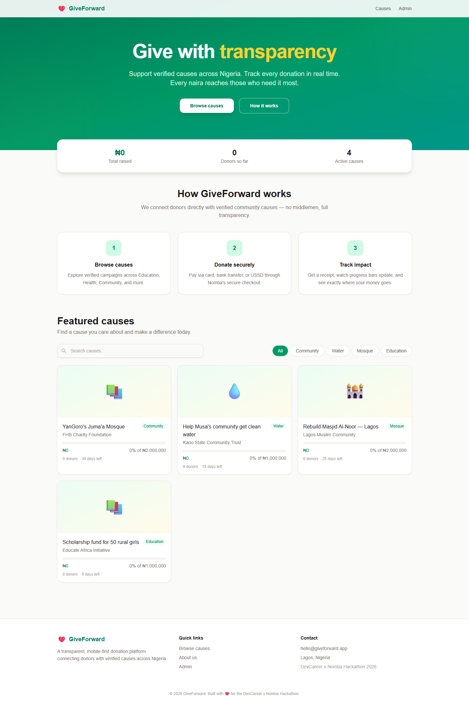
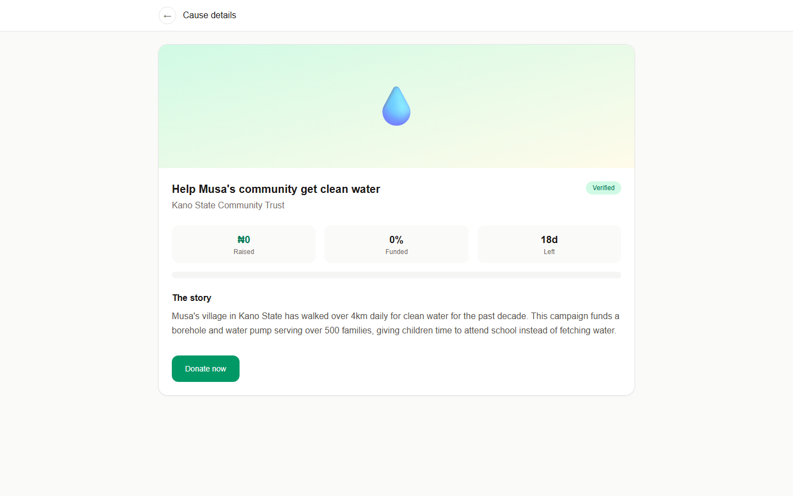
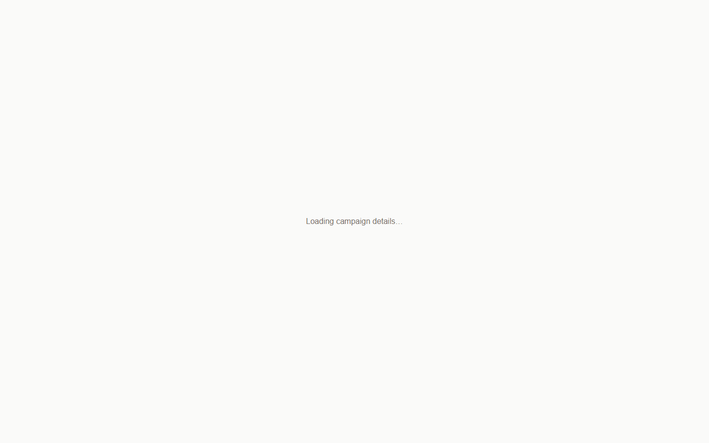
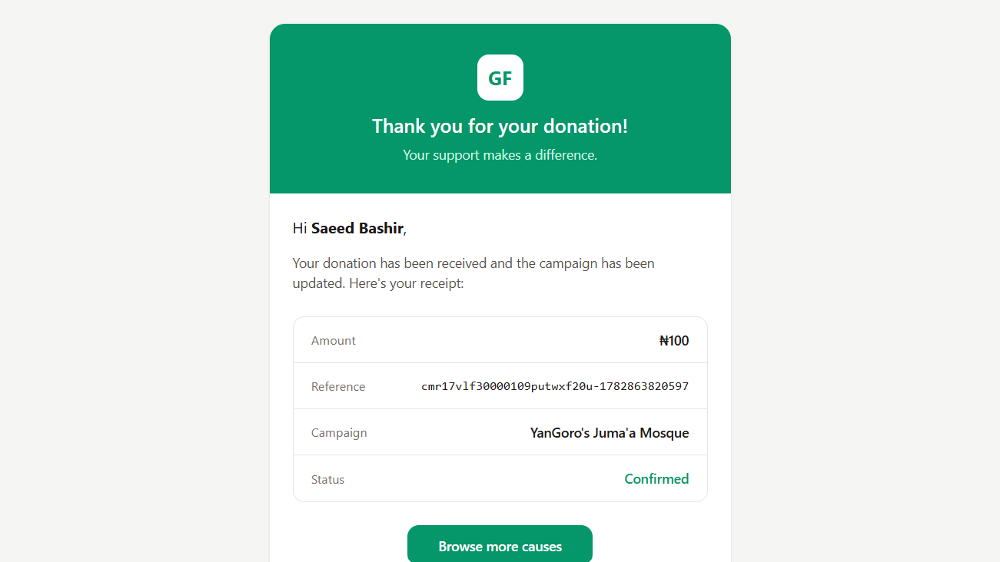
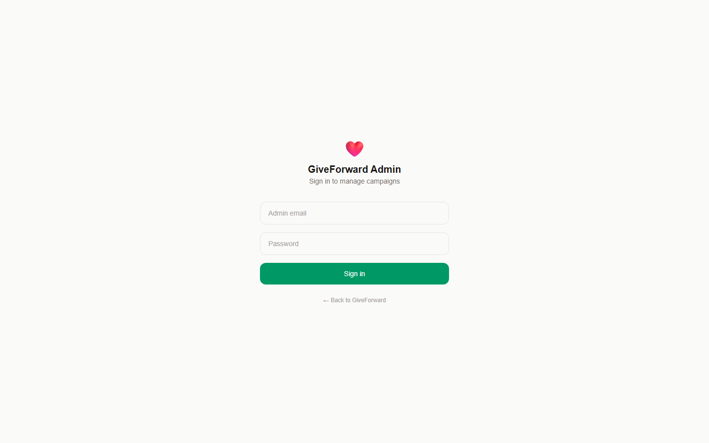

# GiveForward

[](https://hackathon.devcareer.io)

A transparent, **mobile-first donation platform** connecting donors with verified community causes across Nigeria. Built with Next.js, Nomba's payment infrastructure, and Resend for branded email receipts.

> **Status:** Build Phase MVP — DevCareer x Nomba Hackathon 2026

---

## Problem

Millions of Nigerians want to support community causes — building wells, funding scholarships, rebuilding mosques and churches — but lack a **trusted, transparent platform** to do so. Existing options take high fees, lack real-time tracking, or don't verify the causes they list.

## Solution

GiveForward connects donors directly with **verified community causes**. Every naira is tracked. Donors get instant receipts, real-time progress updates, and full visibility into where their money goes — with **zero platform fees**.

---

## Screenshots

| Landing page | Browse causes | Cause detail |
|:---:|:---:|:---:|
|  |  |  |
| **Donation flow** | **Email receipt** | **Admin dashboard** |
|  |  |  |

---

## Tech stack

| Layer | Technology |
|---|---|
| Framework | Next.js 15 (App Router) + TypeScript |
| Styling | Tailwind CSS v4 |
| Database | PostgreSQL (Neon) via Prisma ORM |
| Payments | Nomba Checkout API, Webhooks |
| Email | Resend (branded donation receipts) |
| Deployment | Vercel |

### Nomba APIs integrated

- **Checkout API** — Secure payment flow (card, bank transfer, USSD)
- **Webhooks** — Real-time payment confirmation and donation recording
- **Virtual Accounts** — _In progress_

---

## Features

### Donor experience
- Browse verified causes with live progress bars
- Search and filter causes by category
- Donate via card, bank transfer, or USSD (Nomba Checkout)
- Branded email receipt for every donation
- Anonymous donation option
- Optional support message with donations

### Admin dashboard
- Secure admin login with rate limiting
- Create new fundraising campaigns
- View all campaigns with progress at a glance
- Monitor recent donations in real time

---

## Getting started

```bash
# Clone the repo
git clone https://github.com/strawhatdev01/giveforward.git
cd giveforward

# Install dependencies
npm install

# Set up environment variables
cp .env.local.example .env.local
# Edit .env.local with your Nomba sandbox credentials and Resend API key

# Push the schema and seed data
npx prisma db push
npx prisma db seed

# Run the dev server
npm run dev
```

Visit **http://localhost:3000** to see the app.

---

## Project structure

```
giveforward/
├── app/
│   ├── page.tsx                     Landing page (hero, about, causes)
│   ├── layout.tsx                   Root layout with metadata
│   ├── globals.css                  Tailwind entry point
│   ├── causes/[id]/
│   │   ├── page.tsx                 Cause detail page
│   │   ├── donate/page.tsx          Donation flow page
│   │   └── success/page.tsx         Success / receipt page
│   ├── admin/
│   │   ├── page.tsx                 Admin dashboard
│   │   ├── login/page.tsx           Admin login page
│   │   └── create/page.tsx          Create new campaign form
│   └── api/
│       ├── nomba/
│       │   ├── checkout/route.ts    POST — Create Nomba checkout
│       │   └── webhook/route.ts     POST — Handle payment events
│       ├── admin/login/route.ts     POST — Admin authentication
│       └── causes/route.ts          GET/POST — List / create causes
├── components/
│   ├── header.tsx                   Navigation header
│   ├── footer.tsx                   Site footer
│   └── causes-grid.tsx              Searchable, filterable cause cards
├── lib/
│   ├── data.ts                      Database queries (Prisma)
│   ├── db.ts                        Prisma client singleton
│   ├── email.ts                     Resend email receipts
│   └── nomba.ts                     Nomba API client
├── prisma/
│   ├── schema.prisma                Database schema
│   └── seed.ts                      Seed data
├── public/
│   └── favicon.svg
├── proxy.ts                         Admin route protection middleware
├── .env.local.example               Environment variable template
└── README.md
```

---

## End-to-end donor journey

```
Landing page  →  Browse causes  →  Open a cause  →  Donate  →  Nomba Checkout  →  Success page  →  Email receipt
```

This complete flow is fully functional end-to-end.

---

## Environment variables

| Variable | Description |
|---|---|
| `DATABASE_URL` | PostgreSQL connection string (Neon) |
| `NOMBA_BASE_URL` | Nomba API base URL |
| `NOMBA_ACCOUNT_ID` | Nomba account ID |
| `NOMBA_CLIENT_ID` | Nomba client ID |
| `NOMBA_CLIENT_SECRET` | Nomba client secret |
| `NOMBA_WEBHOOK_SECRET` | Nomba webhook signing secret |
| `RESEND_API_KEY` | Resend API key for email receipts |
| `ADMIN_EMAIL` | Admin login email |
| `ADMIN_PASSWORD` | Admin login password |

---

## Milestones completed

- [x] Project architecture and database schema designed
- [x] Mobile-first UI implemented with Next.js and Tailwind CSS
- [x] Campaign listing with search and category filters
- [x] Campaign detail page with progress and recent donations
- [x] PostgreSQL database integrated using Prisma ORM
- [x] Nomba Checkout API integrated for donation payments
- [x] Nomba webhook endpoint for payment confirmation
- [x] Branded email receipts via Resend
- [x] Admin dashboard with campaign management
- [x] Admin login with rate limiting
- [x] Anonymous donation support
- [x] Responsive, mobile-first design

## In progress

- [ ] Nomba Virtual Accounts for per-cause bank details
- [ ] Cause image upload
- [ ] Campaign editing and management
- [ ] Donation history for repeat donors
- [x] Branded email receipts — feature built, pending domain verification on Resend (restricted to sender's own email in test mode). Will be fully active in final stage with verified domain.

---

## License

This project is built for the **DevCareer x Nomba Hackathon 2026**. Not licensed for commercial use.
